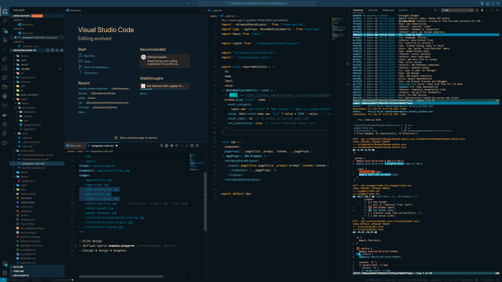

# vscode-theme-seashells

A VS Code theme based on the [SeaShells terminal color scheme](https://iterm2colorschemes.com).

**⚠️ NOTE:** this theme is still a work-in-progress!

<!--  -->

## TODO:

- [ ] **syntax:**
  - [ ] less yellow (don't overuse accent)
  - [ ] more white (classes, etc...)
- [ ] **complete first pass on:**
  - [x] info/warning/error/success statuses
  - [x] DIFF styling
  - [ ] gitlens
  - [x] git-decorations
  - [x] selection
  - [ ] highlight
  - [ ] focus borders
  - [ ] inputs / settings
  - [ ] searching / filtering
  - [ ] boxes, popovers, menus
  - [ ] toolbar
  - [ ] progress bars
- [ ] **complete second pass on:**
  - [ ] activity bar
  - [ ] status bar
  - [x] sidebar / explorer
  - [x] tabs
  - [x] buttons
