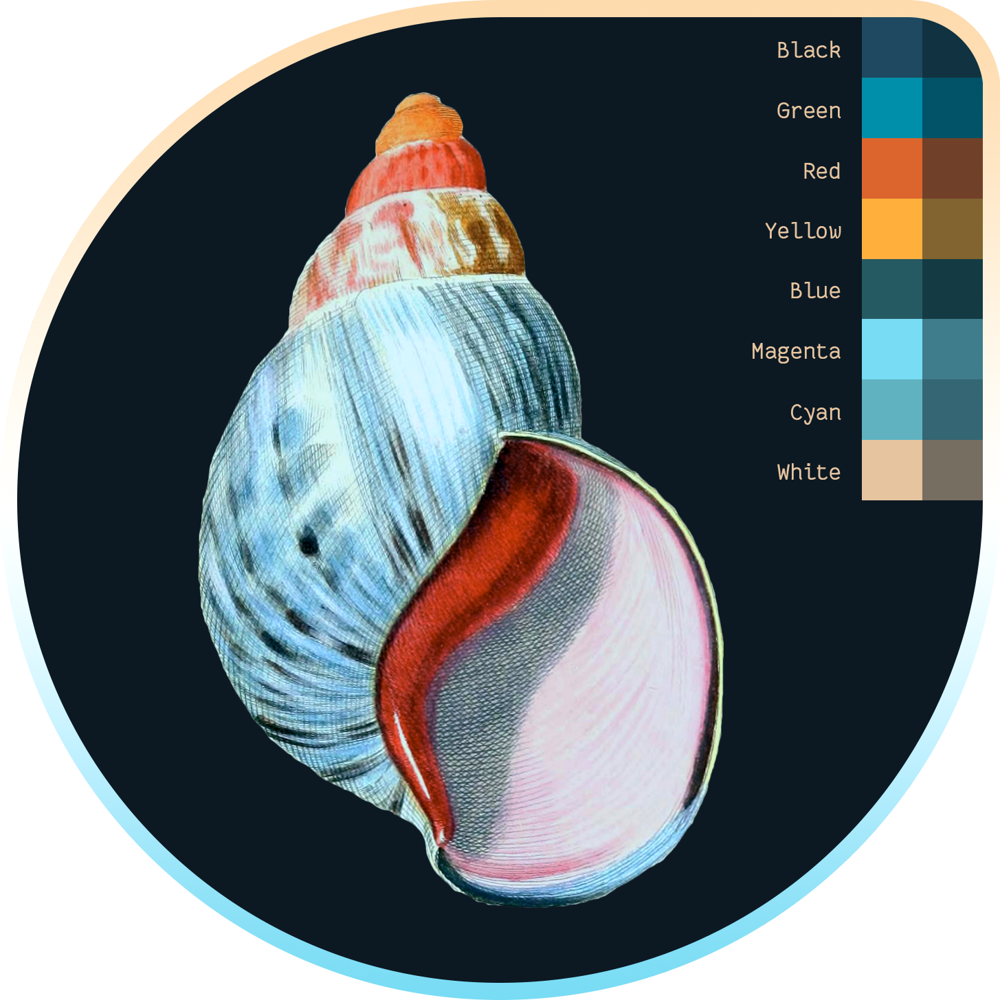

# vscode-theme-seashells

A VS Code theme based on the [SeaShells terminal color scheme](https://iterm2colorschemes.com).

**⚠️ NOTE:** this theme is still a work-in-progress.

## Roadmap

- [ ] Increase legibility of Status Bar
- [ ] Initial pass on search filter/highlight colors
- [ ] Initial pass on links colors
- [ ] Initial pass on [GitLens](https://marketplace.visualstudio.com/items?itemName=eamodio.gitlens) colors
- [ ] Higher contrast variants (better separation between panes)

## Variants

### SeaShells (Dark)

### SeaShells (Light)

<!--  -->

<!--  -->
